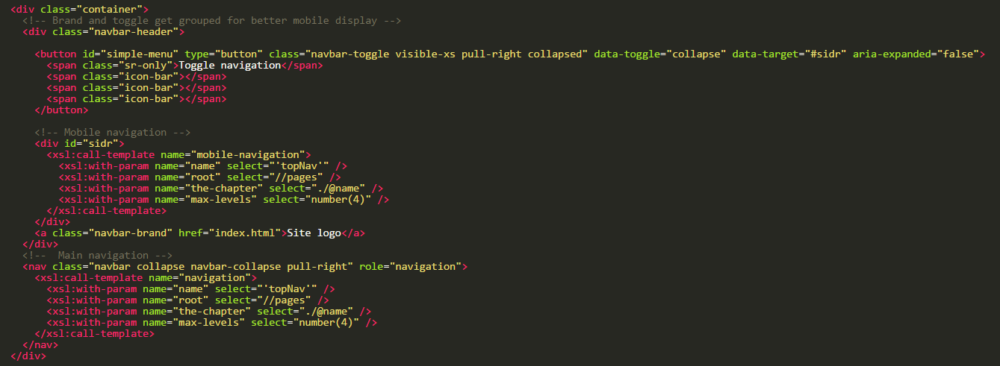
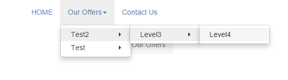

Website navigation
==================

- Plugin for WebPal-powered applications
- Simply add this plugin to your WebPal extensions and start using it in your template
- Includes main navigation (including mobile), side navigation, and breadcrumbs
- This plugin will be easy to plug into your template
- Navigation name uses shorttitle of each pages under 'thecontent' and link is generated from the name of each page
- Any pages that should be hidden from navigation can be to to 'show-in-menu=no'
- In your template, include the following where you want the main navigation should render:

- In your template, include the following where you want the mobile navigation to render:

 <button id="simple-menu" type="button" class="navbar-toggle visible-xs pull-right collapsed" data-toggle="collapse" data-target="#sidr" aria-expanded="false">  
 Toggle navigation  
   
   
   
 </button>

 <!-- Mobile navigation -->  
 
  
 <xsl:call-template name="mobile-navigation">  
 <xsl:with-param name="name" select="'topNav'" />  
 <xsl:with-param name="root" select="//pages" />  
 <xsl:with-param name="the-chapter" select="./@name" />  
 <xsl:with-param name="max-levels" select="number(4)" />  
 </xsl:call-template>  
 

 
For example:

- If you need to increase or decrease the number of max-levels to render, you can change the '_NUMBER_' in <xsl:with-param name="max-levels" select="number(_NUMBER_)" /> to what you want
- End result would look like this:

### Optional:

To include breadcrumbs, add the following code to your template :

 <xsl:call-template name="breadcrumbs">  
 <xsl:with-param name="the-chapter" select="."/>  
 </xsl:call-template>
 To include side navigation, add the following code to your template:

 <xsl:call-template name="side-navigation">  
 <xsl:with-param name="name" select="'sideNav'" />  
 <xsl:with-param name="root" select="(self::page)[1]"/>  
 <xsl:with-param name="current-path" select="(self::page)/@name[1]" />  
 <xsl:with-param name="max-levels" select="number(5)" />  
 </xsl:call-template>
To add sidebar title to be current page name, add the following:

 <xsl:call-template name="sidebarTitle">  
 <xsl:with-param name="root" select="(self::page)[1]"/>  
 </xsl:call-template>
### Plugin used:

- Bootstrap 3
- Sidr - https://www.berriart.com/sidr/
- SmartMenu - http://www.smartmenus.org/