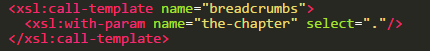

Website navigation
==================

- Plugin for WebPal-powered applications
- Simply add this plugin to your WebPal extensions and start using it in your template
- Includes main navigation (including mobile), side navigation, and breadcrumbs
- This plugin will be easy to plug into your template
- Navigation name uses shorttitle of each pages under 'thecontent' and link is generated from the name of each page
- Any pages that should be hidden from navigation can be to to 'show-in-menu=no'
- In your template, include the following where you want the main navigation should render:

- In your template, include the following where you want the mobile navigation to render:

 
For example:

- If you need to increase or decrease the number of max-levels to render, you can change the '_NUMBER_' in < xsl:with-param name="max-levels" select="number(_NUMBER_)" / > to what you want
- End result would look like this:

Optional:
---------

To include breadcrumbs, add the following code to your template :

To include side navigation, add the following code to your template:

To add sidebar title to be current page name, add the following:

Plugin used:
------------

- Bootstrap 3
- Sidr - https://www.berriart.com/sidr/
- SmartMenu - http://www.smartmenus.org/